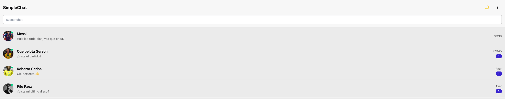
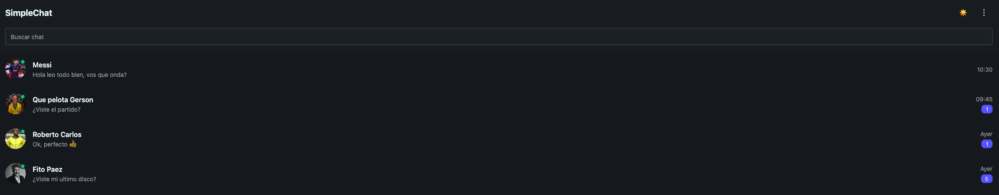
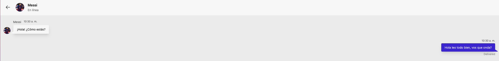
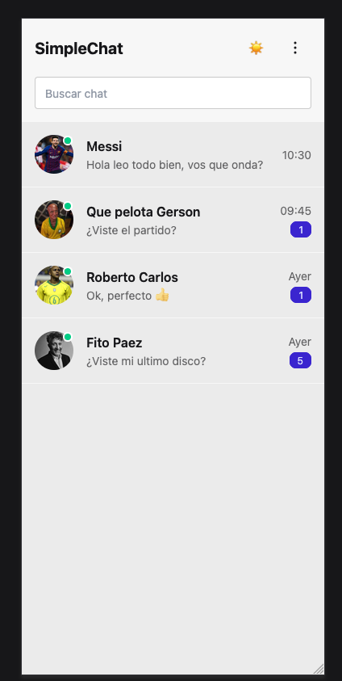

# 💬 SimpleChat - TP Integrador UTN


> **Trabajo Integrador Final** - Diplomatura en Desarrollo Web Full Stack - UTN  
> **Autor:** Martín Basile González

## 📖 Descripción

SimpleChat es una aplicación de chat desarrollada en React que simula la interfaz y funcionalidades básicas de una aplicación de mensajería moderna. El proyecto está enfocado en demostrar conocimientos de React, routing, manejo de estados y diseño responsivo.

## ✨ Características

- 💬 **Chat en tiempo real simulado**
- 🔍 **Búsqueda de conversaciones**
- 📱 **Diseño completamente responsivo**
- 🌙 **Cambio de tema (Light/Dark)**
- 👤 **Avatares personalizados**
- ⏰ **Timestamps de mensajes**
- 🎨 **Interfaz moderna estilo WhatsApp**
- 📋 **Manejo de estados con React Hooks**
- 🛣️ **Navegación con React Router**

## 🚀 Funcionalidades

### Implementadas ✅
- Buscar chats por nombre
- Entrar a conversaciones individuales
- Enviar mensajes (simulado)
- Cambio de temas claro/oscuro
- Avatares de usuarios con fotos
- Timestamps automáticos
- Error 404 personalizado ("que dios quiera nunca pase en producción" 😄)

### Detalles técnicos
- **Responsive Design:** Funciona desde 320px hasta 2000px
- **Componentes modulares:** Arquitectura organizada para evitar "código espagueti"
- **PropTypes:** Validación de tipos en todos los componentes
- **React Router:** Navegación con parámetros dinámicos

## 🛠️ Tecnologías Utilizadas

| Tecnología | Versión | Uso |
|------------|---------|-----|
| **React** | 19.1.0 | Framework principal |
| **Vite** | 7.0.0 | Build tool y dev server |
| **React Router DOM** | 7.6.3 | Navegación y routing |
| **Tailwind CSS** | 3.4.1 | Estilos y utilidades CSS |
| **DaisyUI** | 5.0.43 | Componentes prediseñados |
| **PropTypes** | 15.8.1 | Validación de tipos |

## 📁 Estructura del Proyecto

```
src/
├── components/
│   ├── chat/           # Componentes específicos del chat
│   │   ├── ChatHeader.jsx
│   │   ├── ChatList.jsx
│   │   ├── ChatListItem.jsx
│   │   ├── ChatRoom.jsx
│   │   └── MessageInput.jsx
│   ├── layout/         # Componentes de layout
│   │   └── Navbar.jsx
│   ├── shared/         # Componentes compartidos
│   │   └── Message.jsx
│   └── Home.jsx
├── App.jsx
├── main.jsx
└── index.css
```

## 🚦 Instalación y Uso

### Prerrequisitos
- Node.js 18+
- npm o yarn

### Comandos de instalación

```bash
# Instalar dependencias
npm install

# Iniciar servidor de desarrollo
npm run dev

# Build para producción
npm run build
```

### Comandos utilizados en el desarrollo

```bash
# Crear proyecto React con Vite
npm create vite@latest . -- --template react

# Instalar dependencias principales
npm install

# Instalar y configurar Tailwind CSS
npm install -D tailwindcss postcss autoprefixer

# Instalar React Router
npm install react-router-dom

# Instalar PropTypes para validación
npm install prop-types

# Instalar DaisyUI como plugin de Tailwind
npm install -D daisyui@latest
```

## 🎯 Cumplimiento de Requisitos del TP

- ✅ **React como framework principal**
- ✅ **Uso de estados (useState)**
- ✅ **React Router DOM con parámetros**
- ✅ **Componentes modulares**
- ✅ **Al menos 1 formulario (envío de mensajes)**
- ✅ **2+ páginas (Home y ChatRoom)**
- ✅ **Diseño responsivo (320px - 2000px)**
- ✅ **Estilos accesibles**
- ✅ **README.md completo**

## 🔧 Configuración

### Tailwind + DaisyUI
```javascript
// tailwind.config.js
export default {
  plugins: [require("daisyui")],
  daisyui: {
    themes: ["light", "dark"],
  },
}
```

## 📸 Screenshots

### 🏠 Pantalla Principal
| Modo Claro | Modo Oscuro |
|------------|-------------|
|  |  |

### 💬 Vista de Chat


### 📱 Responsive Design


### ✨ Características destacadas
- **Cambio de tema dinámico** - Switch entre light/dark mode
- **Interfaz responsive** - Se adapta desde móviles hasta desktop
- **Avatares personalizados** - Fotos reales de usuarios
- **Timestamps automáticos** - Hora de envío de mensajes

## 🤝 Contribución

Este proyecto es parte de un trabajo académico, pero sugerencias y mejoras son bienvenidas.

## 👨‍💻 Autor

**Martín Basile González**
- GitHub: [@martinbasile13](https://github.com/martinbasile13)
- Proyecto: [SimpleChat](https://github.com/martinbasile13/UTN-TP-Integrador-SimpleChat)

---

*Desarrollado con ❤️ para la UTN - Diplomatura en Desarrollo Web Full Stack*
    
